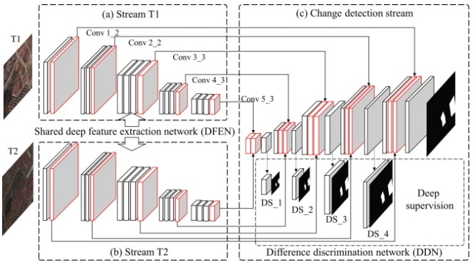

# Readme
## 目录

- [Readme](#readme)
  - [目录](#目录)
  - [模型说明](#模型说明)
  - [模型架构](#模型架构)
  - [数据集](#数据集)
  - [环境要求](#环境要求)
  - [脚本说明](#脚本说明)
    - [脚本和示例代码](#脚本和示例代码)
    - [训练过程](#训练过程)
      - [脚本参数](#脚本参数)
      - [训练](#训练)
    - [评估过程](#评估过程)
    - [推理过程](#推理过程)
  - [随机情况说明](#随机情况说明)
  - [ModelZoo主页](#modelzoo主页)

## [模型说明](#目录)

提出了一种深度监督图像融合网络(IFN)用于高分辨率双时间遥感图像的变化检测。具体而言，首先通过全卷积双流架构提取双时间图像中具有高度代表性的深度特征。然后，将提取的深度特征输入深度监督差分识别网络(DDN)进行变化检测。为了提高输出变化图中对象的边界完整性和内部紧凑性，通过注意模块进行变化图重建，将原始图像的多层次深层特征与图像差异特征融合。DDN通过直接向网络的中间层引入变化图损失来进一步增强，并对整个网络进行端到端的训练。

[Paper:](https://doi.org/10.1016/j.isprsjprs.2020.06.003)  
C. Zhang et al., "A deeply supervised image fusion network for change detection in high resolution bi-temporal remote sensing images," ISPRS Journal of Photogrammetry and Remote Sensing, vol. 166, pp. 183-200, 2020/08/01/ 2020, doi: https://doi.org/10.1016/j.isprsjprs.2020.06.003.


Github:
[https://github.com/GeoZcx/A-deeply-supervised-image-fusion-network-for-change-detection-in-remote-sensing-images](https://github.com/GeoZcx/A-deeply-supervised-image-fusion-network-for-change-detection-in-remote-sensing-images)  

## [模型架构](#目录)



## [数据集](#目录)

1. 下载常用的遥感变化检测影像数据集，如WHU ChangeDetection, LEVIR-CD等
   本例中使用的数据集：[LEVIR-CD](https://justchenhao.github.io/LEVIR/)
2. 将数据集整理成如下格式：
注意：T1、T2、Label中的图片名字必须对应！
```
.. code-block::
        .
        └── image_folder_dataset_directory
             ├── T1
             │    ├── 000000000001.jpg
             │    ├── 000000000002.jpg
             │    ├── ...
             ├── T2
             │    ├── 000000000001.jpg
             │    ├── 000000000002.jpg
             │    ├── ...
             ├── Label
             │    ├── 000000000001.jpg
             │    ├── 000000000002.jpg
             │    ├── ...
```

## [环境要求](#目录)
本代码为GPU平台**单卡**版本

- 硬件 Ascend
    - 使用 GPU 准备硬件环境。
- 框架
    - [LuojiaNet](http://58.48.42.237/luojiaNet/)
- 更多关于LuojiaNet的信息，请查看以下资源：
    - [LuojiaNet Tutorials](http://58.48.42.237/luojiaNet/tutorial/quickstart/)
    - [LuojiaNet Python API](http://58.48.42.237/luojiaNet/luojiaNetapi/)

## [脚本说明](#目录)

### [脚本和示例代码](#目录)

```text
└─DSIFN
  ├─README.md
  ├─README_CN.md
  ├─dataset.py                      # 数据读取文件
  ├─IFN.py                          # IFN网络模型
  ├─loss.py                         # Loss 函数
  ├─eval.py                         # 评估结果
  ├─prediction.py                   # 模型推理
  ├─config.py                       # 模型设置
  └─train.py                        # 训练网络
```

### [训练过程](#目录)

#### [脚本参数](#目录)

config.py中主要参数如下：

```
    "device_target":"GPU",      #GPU \ CPU \ Ascend
    "device_id":0,  #显卡ID
    "dataset_path": "/cache/data/",  #数据存放位置
    "save_checkpoint_path": "/cache/checkpoint",  #保存的参数存放位置
    "resume":False,   #是否载入模型训练
    "batch_size": 8,
    "aug" : True,
    "steps_per_epoch": 200,
    "epoch_size": 200, #训练次数
    "save_checkpoint": True, #是否保存模型
    "save_checkpoint_epochs": 200, #多少次迭代保存一次模型
    "keep_checkpoint_max": 10, #保存模型的最大个数
    "decay_epochs": 20, #学习率衰减的epoch数
    "max_lr": 0.001, #最大学习率
    "min_lr": 0.00001 #最小学习率
```

#### [训练](#目录)
在终端运行``python train.py``进行训练

### [评估过程](#目录)

训练好的模型会根据前面设置的参数保存在相应的目录下，选择合适的模型，使用eval.py进行评估，在终端运行``python eval.py --checkpoint_path **** --dataset_path ****``进行评估，其参数设置如下   
```
    --checkpoint_path, type=str, default=None, help='Saved checkpoint file path'
    --dataset_path, type=str, default=None, help='Eval dataset path'
    --device_target, type=str, default=config.device_target, help='Device target'
    --device_id, type=int, default=config.device_id, help='Device id'
```
### [推理过程](#目录)

训练好的模型会根据前面设置的参数保存在相应的目录下，选择合适的模型，使用prediction.py进行推理，在终端运行``python prediction.py --checkpoint_path **** --dataset_path ****``或``python prediction.py --checkpoint_path **** --left_input_file **** --right_input_file ****``进行推理，其参数设置如下 

```
    --checkpoint_path, type=str, default=None, help='Saved checkpoint file path'
    --dataset_path, type=str, default=None, help='Predict dataset path'
    --left_input_file, type=str, default=None, help='Pre-period image'
    --right_input_file, type=str, default=None, help='Post-period image'
    --output_folder, type=str, default="./result", help='Results path'
    --device_target, type=str, default=config.device_target, help='Device target'
    --device_id, type=int, default=config.device_id, help='Device id'
```

## [随机情况说明](#目录)

在eval.py中，我们设置了初始化的种子。
在prediction.py中，我们设置了初始化的种子。

## [ModelZoo主页](#目录)

请浏览[Model Zoo](https://github.com/WHULuoJiaTeam/Model_Zoo)。
