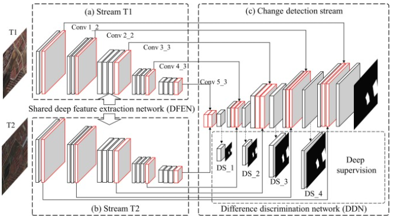

# Readme

## Contents

- [Readme](#readme)
  - [Contents](#contents)
  - [Model Description](#model-description)
  - [Model Architecture](#model-architecture)
  - [Dataset](#dataset)
  - [Environment Requirements](#environment-requirements)
  - [Script Description](#script-description)
    - [Script and Sample Code](#script-and-sample-code)
    - [Training Process](#training-process)
      - [Script Parameters](#script-parameters)
      - [Training](#training)
    - [Evaluation Process](#evaluation-process)
    - [Inference Process](#inference-process)
  - [Description of Random Situation](#description-of-random-situation)
  - [ModelZoo Homepage](#modelzoo-homepage)

## [Model Description](#contents)

 This is a deeply supervised image fusion network (IFN) for change detection in high resolution bi-temporal remote sensing images.  Specifically, highly representative deep features of bi-temporal images are firstly extracted through a fully convolutional two-stream architecture.  Then, the extracted deep features are fed into a deeply supervised difference discrimination network (DDN) for change detection.  To improve boundary completeness and internal compactness of objects in the output change maps, multi-level deep features of raw images are fused with image difference features by means of attention modules for change map reconstruction.  DDN is further enhanced by directly introducing change map losses to intermediate layers in the network, and the whole network is trained in an end-to-end manner.

[Paper:](https://doi.org/10.1016/j.isprsjprs.2020.06.003)  
C. Zhang et al., "A deeply supervised image fusion network for change detection in high resolution bi-temporal remote sensing images," ISPRS Journal of Photogrammetry and Remote Sensing, vol. 166, pp. 183-200, 2020/08/01/ 2020, doi: https://doi.org/10.1016/j.isprsjprs.2020.06.003.


Github:
[https://github.com/GeoZcx/A-deeply-supervised-image-fusion-network-for-change-detection-in-remote-sensing-images](https://github.com/GeoZcx/A-deeply-supervised-image-fusion-network-for-change-detection-in-remote-sensing-images)  

## [Model Architecture](#contents)



## [Dataset](#contents)

1. Download remote sensing building change detection image dataset, such as WHU ChangeDetection, LEVIR-CD, etc.
  The dataset used for this example：[WHU Building change detection dataset](http://gpcv.whu.edu.cn/data/building_dataset.html) 

2. Organize the data set into the following format:
**Note:** The picture names in **T1, T2 and Label** must correspond!

```
.. code-block::
        .
        └── image_folder_dataset_directory
             ├── T1
             │    ├── 000000000001.jpg
             │    ├── 000000000002.jpg
             │    ├── ...
             ├── T2
             │    ├── 000000000001.jpg
             │    ├── 000000000002.jpg
             │    ├── ...
             ├── Label
             │    ├── 000000000001.jpg
             │    ├── 000000000002.jpg
             │    ├── ...
```
## [Environment Requirements](#contents)

This code is GPU platform **1P** version

- Hardware
    - Prepare hardware environment with GPU platform.
- Framework
    - [LuojiaNet](http://58.48.42.237/luojiaNet/)
- For more information, please check the resources below：
    - [LuojiaNet tutorials](http://58.48.42.237/luojiaNet/tutorial/quickstart/)
    - [LuojiaNet Python API](http://58.48.42.237/luojiaNet/luojiaNetapi/)


## [Script Description](#contents)

### [Script and Sample Code](#contents)

```text
└─Building_CD
  ├─README.md
  ├─README_CN.md
  ├─dataset.py                      # Dataset IO
  ├─IFN.py                          # IFN network model
  ├─loss.py                         # Loss function
  ├─eval.py                         # Evaluating results
  ├─prediction.py                   # Inference side code
  ├─config.py                       # Model configuration
  └─train.py                        # Training the network
```


### [Training Process](#contents)

#### [Script Parameters](#contents)

Major parameters ``config.py`` as follows:


```
    "device_target":"GPU",      #GPU \ CPU \ Ascend
    "device_id":0,  # device ID
    "dataset_path": "/cache/data/",  # datset path
    "save_checkpoint_path": "/cache/checkpoint",   # save checkpoint path
    "resume":False,   # Whether to load pretrained model to train
    "batch_size": 8,
    "aug" : True,
    "steps_per_epoch": 200,
    "epoch_size": 200, 
    "save_checkpoint": True, # Whether to save checkpoint
    "save_checkpoint_epochs": 200, # Save the model for every xx epoches
    "keep_checkpoint_max": 10, # The maximum number of models to save
    "decay_epochs": 20, # The number of epochs that the learning rate decays
    "max_lr": 0.001, # Maximum learning rate
    "min_lr": 0.00001 # Minimum learning rate
```


#### [Training](#contents)

Run ``python train.py`` on the terminal for training


### [Evaluation Process](#contents)

Run ``python eval.py --checkpoint_path **** --dataset_path ****`` on the terminal to evaluate, with the following parameters:

```
    --checkpoint_path, type=str, default=None, help='Saved checkpoint file path'
    --dataset_path, type=str, default=None, help='Eval dataset path'
    --device_target, type=str, default=config.device_target, help='Device target'
    --device_id, type=int, default=config.device_id, help='Device id'
```

### [Inference Process](#contents)

Run``python prediction.py --checkpoint_path **** --dataset_path ****`` or ``python prediction.py --checkpoint_path **** --left_input_file **** --right_input_file ****`` on the terminal to inference, with the following parameters:

```
    --checkpoint_path, type=str, default=None, help='Saved checkpoint file path'
    --dataset_path, type=str, default=None, help='Predict dataset path'
    --left_input_file, type=str, default=None, help='Pre-period image'
    --right_input_file, type=str, default=None, help='Post-period image'
    --output_folder, type=str, default="./result", help='Results path'
    --device_target, type=str, default=config.device_target, help='Device target'
    --device_id, type=int, default=config.device_id, help='Device id'
```

## [Description of Random Situation](#contents)

There are random seeds in ``eval.py`` and ``prediction.py`` files.

## [ModelZoo Homepage](#contents)

Please check the [Model Zoo](https://github.com/WHULuoJiaTeam/Model_Zoo).
