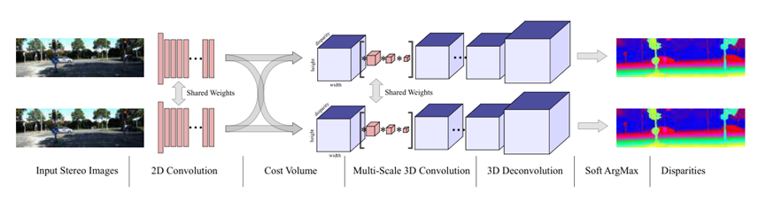

# Contents

- [Contents](#contents)
- [MVSNetDescription](#mvsnetdescription)
- [Model Architecture](#model-architecture)
- [Dataset](#dataset)
- [Environment Requirements](#environment-requirements)
- [Quick Start](#quick-start)
- [Script Description](#script-description)
  - [Script and Sample Code](#script-and-sample-code)
  - [Script Parameters](#script-parameters)
  - [Training Process](#training-process)
    - [Training](#training)
  - [Evaluation Process](#evaluation-process)
    - [Valid](#valid)
  - [Inference Process](#inference-process)
    - [Usage](#usage)
    - [结果](#结果)
- [ModelZoo Homepage](#modelzoo-homepage)

# [MVSNetDescription](#contents)

GC-Net (Geometry and Context Network) is a classic binocular stereo matching model based on 
deep learning. It completes the process of binocular dense matching in an end-to-end way. With 
the corrected kernel stereoscopic image pairs as input, GC-net learns the parallax map from the 
network feature mapping. Without any manual design features and post-processing, stereo matching
at the sub-pixel level can be achieved, greatly reducing the complexity of engineering design. 
GC-Net network takes into account both image plane features and parallax value in the form of 
3D features, and has extremely high robustness and accuracy. It is the basic architecture of 
most stereo matching methods at present.

[Paper](https://openaccess.thecvf.com/content_ICCVW_2019/html/NeurArch/Cao_GCNet_Non-Local_Networks_Meet_Squeeze-Excitation_Networks_and_Beyond_ICCVW_2019_paper.html)：
Cao Y, Xu J, Lin S, et al. Gcnet: Non-local networks meet squeeze-excitation networks and beyond[C]//Proceedings of the IEEE/CVF international conference on computer vision workshops. 2019: 0-0.

# [Model Architecture](#contents)



# [Dataset](#contents)

Dataset used：[WHU-stereo](http://gpcv.whu.edu.cn/data/WHU_MVS_Stereo_dataset.html)  
Annotation support：[WHU-stereo]or annotation as the same format as WHU-MVS 


- The directory structure is as follows：

    ```text
        ├── dataset
            ├── WHU_stereo_dataset
                ├── README.txt
                ├── test_index.txt
                ├── train_index.txt
                ├── test
                │   ├─ 009_53
                │   │  ├─ Disparity
                │   │  │  ├─ 000000.png
                │   │  │  └─ ...
                │   │  ├─ Left
                │   │  │  ├─ 000000.png
                │   │  │  └─ ...
                │   │  ├─ Right
                │   │     ├─ 000000.png
                │   │     └─ ...
                │   ├── ...
                ├── train
                    ├─ 002_35
                    │  ├─ Disparity
                    │  │  ├─ 000000.png
                    │  │  └─ ...
                    │  ├─ Left
                    │  │  ├─ 000000.png
                    │  │  └─ ...
                    │  ├─ Right
                    │     ├─ 000000.png
                    │     └─ ...
                    ├── ...
    ```

we suggest user to use WHU-stereo dataset to experience our model,
other datasets need to use the same format as WHU-stereo.

# [Environment Requirements](#contents)

- Hardware（Ascend）
    - Prepare hardware environment with Ascend processor.
- Framework
    - [LuojiaNet](http://58.48.42.237/luojiaNet/)
- For more information, please check the resources below：
    - [LuojiaNet tutorials](https://www.luojianet.cn/tutorials/zh-CN/master/index.html)
    - [LuojiaNet Python API](https://www.luojianet.cn/docs/zh-CN/master/index.html)

# [Quick Start](#contents)

- After installing MindSpore via the official website, you can start training and evaluation as follows:

- Train on [ModelArts](https://support.huaweicloud.com/modelarts/)

  ```text
  # Train 8p with Ascend
  # (1) Perform a or b.
  #       a. Set "enable_modelarts=True" on base_config.yaml file.
  #          Set "data_root='s3://dir_to_your_data'" on base_config.yaml file.
  #          Set "train_list='s3://dir_to_training_list/'" on base_config.yaml file.
  #          Set "valid_list='s3://dir_to_validation_list/'" on base_config.yaml file.
  #          Set other parameters on base_config.yaml file you need.
  #       b. Add "enable_modelarts=True" on the website UI interface.
  #          Add "data_root=s3://dir_to_your_data" on the website UI interface.
  #          Add "train_list=s3://dir_to_training_list/" on the website UI interface.
  #          Add "valid_list=s3://dir_to_validation_list/" on the website UI interface.
  #          Add other parameters on the website UI interface.
  # (3) Upload or copy your pretrained model to S3 bucket.
  # (4) Upload a zip dataset to S3 bucket. (you could also upload the origin dataset, but it can be so slow.)
  # (5) Set the code directory to "/path/GCNet" on the website UI interface.
  # (6) Set the startup file to "train.py" on the website UI interface.
  # (7) Set the "Dataset path" and "Output file path" and "Job log path" to your path on the website UI interface.
  # (8) Create your job.
  #
  # Eval 8p with Ascend
  # (1) Perform a or b.
  #       a. Set "enable_modelarts=True" on base_config.yaml file.
  #          Set "data_root='s3://dir_to_your_data'" on base_config.yaml file.
  #          Set "model_path='s3://dir_to_your_trained_ckpt/'" on base_config.yaml file.
  #          Set "eval_list='s3://dir_to_validation_list/'" on base_config.yaml file.
  #          Set other parameters on base_config.yaml file you need.
  #       b. Add "enable_modelarts=True" on the website UI interface.
  #          Add "data_root=s3://dir_to_your_data" on the website UI interface.
  #          Add "model_path=s3://dir_to_your_trained_ckpt/" on the website UI interface.
  #          Add "eval_list=s3://dir_to_validation_list/" on the website UI interface.
  #          Add other parameters on the website UI interface.
  # (3) Upload or copy your pretrained model to S3 bucket.
  # (4) Upload a zip dataset to S3 bucket. (you could also upload the origin dataset, but it can be so slow.)
  # (5) Set the code directory to "/path/GCNet" on the website UI interface.
  # (6) Set the startup file to "eval.py" on the website UI interface.
  # (7) Set the "Dataset path" and "Output file path" and "Job log path" to your path on the website UI interface.
  # (8) Create your job.
  #
  # Test 8p with Ascend
  # (1) Perform a or b.
  #       a. Set "enable_modelarts=True" on base_config.yaml file.
  #          Set "data_root='s3://dir_to_your_data'" on base_config.yaml file.
  #          Set "model_path='s3://dir_to_your_trained_ckpt/'" on base_config.yaml file.
  #          Set "eval_list='s3://dir_to_validation_list/'" on base_config.yaml file.
  #          Set "save_path='s3://dir_to_save_output/'" on base_config.yaml file.
  #          Set other parameters on base_config.yaml file you need.
  #       b. Add "enable_modelarts=True" on the website UI interface.
  #          Add "data_root=s3://dir_to_your_data" on the website UI interface.
  #          Add "model_path=s3://dir_to_your_trained_ckpt/" on the website UI interface.
  #          Add "eval_list=s3://dir_to_validation_list/" on the website UI interface.
  #          Add "save_path=s3://dir_to_save_output/" on the website UI interface.
  #          Add other parameters on the website UI interface.
  # (3) Upload or copy your pretrained model to S3 bucket.
  # (4) Upload a zip dataset to S3 bucket. (you could also upload the origin dataset, but it can be so slow.)
  # (5) Set the code directory to "/path/MVSNet" on the website UI interface.
  # (6) Set the startup file to "predict.py" on the website UI interface.
  # (7) Set the "Dataset path" and "Output file path" and "Job log path" to your path on the website UI interface.
  # (8) Create your job.
  ```

# [Script Description](#contents)

## [Script and Sample Code](#contents)

```text
└─GCNet
  ├─README.md
  ├─README_CN.md
  ├─figs
    ├─network.png
    ├─result.png 
  ├─list
    ├─readme.md
    ├─whu_training.txt
    ├─whu_validation.txt
  ├─scripts
    ├─eval.sh                         # Start stand-alone verification in Ascend
    ├─predict.sh                      # Start single machine prediction in Ascend
    ├─train.sh                        # Start single-player training in Ascend
  ├─src
    ├─dataset.py                      # Data read file
    ├─data_io.py                      # Data read and write tool
    ├─benchmark_callback.py           # Intermediate result generation tool
    ├─GCNet.py                        # GCNet network model
  ├─eval.py                           # Evaluate test results
  ├─predict.py                        # Inference side code
  └─train.py                          Inference side code
```

## [Script Parameters](#contents)

Major parameters train.py as follows:

```text
Optional parameter：
  --data_root           Training data set directory
  --train_list          Training set directory
  --valid_list          Validation set directory
  --crop_h              Crop height
  --crop_w              Crop image width
  --max_disp            Maximum parallax
  --max_h               Maximum height of image
  --batch               Number of batches for each training session
  --epochs              Total number of iterations
  --lr                  Learning rate
  --amp_level           amp level
  --save_ckpt_epochs    Save the number of iterations of ckpt
  --keep_checkpoint_max Save the number of iterations of ckpt
  --logdir              Output path of ckpt
```

## [Training Process](#contents)

### Training

For Ascend device, standalone training example(1p) by console

```bash
sh train.sh
```
or
```
python train.py --train_list="list/whu_training.txt" --valid_list="list/whu_validation.txt" --data_root=your_dataset_path
```

The python command above will run in the background, you can view the results through the console.

After the training, you can find the checkpoint file under the specified output folder. The following loss values are obtained：

```text
INFO:epoch[1], iter[1], loss:13.840265274047852
INFO:epoch[1], iter[100], loss:7.966899394989014
INFO:epoch[1], iter[200], loss:3.101147413253784
INFO:epoch[1], iter[300], loss:1.9435290098190308
INFO:epoch[1], iter[400], loss:0.6899499297142029
INFO:epoch[1], iter[500], loss:0.55366450548172
...
```

## [Evaluation Process](#contents)

### Valid

Execute the following commands in the LuoJiaNet environment for evaluation

```bash
sh eval.sh
```
or
```
python eval.py --eval_list="list/whu_validation.txt" --crop_h=384 --crop_w=768 --max_disp=160 --dataset_type="whu" --model_path="checkpoint/checkpoint_gcnet_whu-20_8316.ckpt"
```

The above python command will run in the background. You can view the results via the console.

```text
Iteration[2563|2618] name: 010_38/002009, mae(pixel): 0.09399664402008057, <1(%):0.9961039225260416, <2(%):0.9987521701388888, <3(%):0.99920654296875
Iteration[2564|2618] name: 010_38/011009, mae(pixel): 0.08075002829233806, <1(%):0.9961886935763888, <2(%):0.9990336100260416, <3(%):0.9996914333767362
Iteration[2565|2618] name: 010_38/013000, mae(pixel): 0.10973523722754584, <1(%):0.9964497884114584, <2(%):0.9978739420572916, <3(%):0.9983350965711806
Iteration[2566|2618] name: 010_38/008008, mae(pixel): 0.10264833768208821, <1(%):0.99542236328125, <2(%):0.9982401529947916, <3(%):0.9987725151909722
Iteration[2567|2618] name: 010_38/002006, mae(pixel): 0.08011961645550197, <1(%):0.9998541937934028, <2(%):0.9999932183159722, <3(%):1.0
...
```

## [Inference Process](#contents)

### Usage


```shell
python predict.py --predict_list="list/whu_validation.txt" --crop_h=384 --crop_w=768 --max_disp=160 --dataset_type="whu" --model_path="checkpoint/checkpoint_gcnet_whu-20_8316.ckpt" --save_path="output/luojia_result"
```

### 结果

Inference result is saved in current path, you can find result like this in log file.

```text
Iteration[606|2618] name: 011_38/000003, cost time:0.4417119026184082s
Iteration[607|2618] name: 011_38/012007, cost time:0.4443039894104004s
Iteration[608|2618] name: 011_38/006004, cost time:0.44126009941101074s
Iteration[609|2618] name: 011_38/008006, cost time:0.4430112838745117s
Iteration[610|2618] name: 011_38/008001, cost time:0.441241979598999s
Iteration[611|2618] name: 011_38/011003, cost time:0.44088149070739746s
Iteration[612|2618] name: 011_38/011010, cost time:0.44397759437561035s
Iteration[613|2618] name: 011_38/012005, cost time:0.4408755302429199s
Iteration[614|2618] name: 011_38/001001, cost time:0.4408762454986572s
Iteration[615|2618] name: 011_38/002002, cost time:0.44150805473327637s
Iteration[616|2618] name: 012_41/009006, cost time:0.4435269832611084s
...
```

# [ModelZoo Homepage](#contents)

 Please check the official [homepage](https://gitee.com/mindspore/models).

