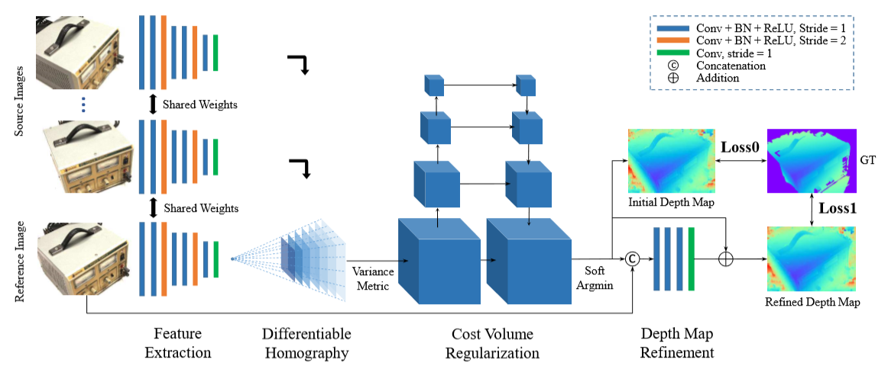

# Contents

- [Contents](#contents)
- [MVSNet Description](#MVSNet-description)
- [Model Architecture](#model-architecture)
- [Dataset](#dataset)
- [Environment Requirements](#environment-requirements)
- [Quick Start](#quick-start)
- [Script Description](#script-description)
  - [Script and Sample Code](#script-and-sample-code)
  - [Script Parameters](#script-parameters)
  - [Training Process](#training-process)
    - [Training](#training)
    - [Distributed Training](#distributed-training)
    - [Transfer Training](#transfer-training)
  - [Evaluation Process](#evaluation-process)
    - [Valid](#valid)
  - [Convert Process](#convert-process)
    - [Convert](#convert)
  - [Inference Process](#inference-process)
    - [Usage](#usage)
    - [result](#result)
- [ModelZoo Homepage](#modelzoo-homepage)

# [MVSNetDescription](#contents)

MVSNet (Multi-view Stereo Network) is a classical end-to-end deep learning multi-view dense matching model for dense 
matching of scenes with multi-view images, without the help of kernel line images and parallax values, but directly 
from the original multi-view images, a central image and several auxiliary images, as well as the camera pose parameters 
corresponding to the images, are used as The depth map corresponding to the central image is obtained as input. MVSNet 
explicitly encodes the multiview imaging geometry into the deep learning network, thus enabling the dense matching task 
between multiview images end-to-end with the support of geometric constraints, and is the basis and core building block 
of existing general multiview dense matching methods.

[Paper](https://openaccess.thecvf.com/content_ECCV_2018/html/Yao_Yao_MVSNet_Depth_Inference_ECCV_2018_paper.html)：
Yao Y, Luo Z, Li S, et al. Mvsnet: Depth inference for unstructured multi-view stereo[C]//Proceedings of the European Conference on Computer Vision (ECCV). 2018: 767-783.

# [Model Architecture](#contents)



# [Dataset](#contents)

Dataset used：[WHU-MVS](http://gpcv.whu.edu.cn/data/WHU_MVS_Stereo_dataset.html)  
Annotation support：[WHU-MVS]or annotation as the same format as WHU-MVS 


- The directory structure is as follows：

    ```text
        ├── dataset
            ├── WHU_MVS_dataset
                ├── README.txt
                ├── test
                │   ├─ index.txt
                │   ├─ pair.txt
                │   ├─ Cams
                │   │   ├─ 009_53
                │   │   │  ├─ 0
                │   │   │  │  ├─ 000000.txt
                │   │   │  │  └─ ...
                │   │   │  └─ ...
                │   │   └─ ...
                │   ├─ Depths
                │   │   ├─ 009_53
                │   │   │  ├─ 0
                │   │   │  │  ├─ 000000.png
                │   │   │  │  └─ ...
                │   │   │  └─ ...
                │   │   └─ ...
                │   ├─ Images
                │   │   ├─ 009_53
                │   │   │  ├─ 0
                │   │   │  │  ├─ 000000.png
                │   │   │  │  └─ ...
                │   │   │  └─ ...
                │   │   └─ ...
                ├── train
                    ├─ index.txt
                    ├─ pair.txt
                    ├─ Cams
                    │   ├─ 009_53
                    │   │  ├─ 0
                    │   │  │  ├─ 000000.txt
                    │   │  │  └─ ...
                    │   │  └─ ...
                    │   └─ ...
                    ├─ Depths
                    │   ├─ 009_53
                    │   │  ├─ 0
                    │   │  │  ├─ 000000.png
                    │   │  │  └─ ...
                    │   │  └─ ...
                    │   └─ ...
                    ├─ Images
                        ├─ 009_53
                        │  ├─ 0
                        │  │  ├─ 000000.png
                        │  │  └─ ...
                        │  └─ ...
                        └─ ...
    ```

we suggest user to use WHU-MVS dataset to experience our model,
other datasets need to use the same format as WHU-MVS.

# [Environment Requirements](#contents)

- Hardware（Ascend）
    - Prepare hardware environment with Ascend processor.
- Framework
    - [LuojiaNet](http://58.48.42.237/luojiaNet/)
- For more information, please check the resources below：
    - [LuojiaNet tutorials](https://www.luojianet.cn/tutorials/zh-CN/master/index.html)
    - [LuojiaNet Python API](https://www.luojianet.cn/docs/zh-CN/master/index.html)

# [Quick Start](#contents)

- Train on [ModelArts](https://support.huaweicloud.com/modelarts/)

  ```text
  # Train 8p with Ascend
  # (1) Perform a or b.
  #       a. Set "enable_modelarts=True" on base_config.yaml file.
  #          Set "data_root='s3://dir_to_your_data'" on base_config.yaml file.
  #          Set "logdir='s3://dir_to_save_your_checkpoints/'" on base_config.yaml file.
  #          Set other parameters on base_config.yaml file you need.
  #       b. Add "enable_modelarts=True" on the website UI interface.
  #          Add "data_root=s3://dir_to_your_data" on the website UI interface.
  #          Add "logdir=s3://dir_to_save_your_checkpoints/" on the website UI interface.
  #          Add other parameters on the website UI interface.
  # (3) Upload or copy your pretrained model to S3 bucket.
  # (4) Upload a zip dataset to S3 bucket. (you could also upload the origin dataset, but it can be so slow.)
  # (5) Set the code directory to "/path/MVSNet" on the website UI interface.
  # (6) Set the startup file to "train.py" on the website UI interface.
  # (7) Set the "Dataset path" and "Output file path" and "Job log path" to your path on the website UI interface.
  # (8) Create your job.
  #
  # Eval 8p with Ascend
  # (1) Perform a or b.
  #       a. Set "enable_modelarts=True" on base_config.yaml file.
  #          Set "data_root='s3://dir_to_your_data'" on base_config.yaml file.
  #          Set "loadckpt='s3://dir_to_your_trained_ckpt/'" on base_config.yaml file.
  #          Set other parameters on base_config.yaml file you need.
  #       b. Add "enable_modelarts=True" on the website UI interface.
  #          Add "data_root=s3://dir_to_your_data" on the website UI interface.
  #          Add "loadckpt=s3://dir_to_save_your_checkpoints/" on the website UI interface.
  #          Add other parameters on the website UI interface.
  # (3) Upload or copy your pretrained model to S3 bucket.
  # (4) Upload a zip dataset to S3 bucket. (you could also upload the origin dataset, but it can be so slow.)
  # (5) Set the code directory to "/path/MVSNet" on the website UI interface.
  # (6) Set the startup file to "eval.py" on the website UI interface.
  # (7) Set the "Dataset path" and "Output file path" and "Job log path" to your path on the website UI interface.
  # (8) Create your job.
  #
  # Test 8p with Ascend
  # (1) Perform a or b.
  #       a. Set "enable_modelarts=True" on base_config.yaml file.
  #          Set "data_root='s3://dir_to_your_data'" on base_config.yaml file.
  #          Set "loadckpt='s3://dir_to_your_trained_ckpt/'" on base_config.yaml file.
  #          Set "output='s3://dir_to_your_output'" on base_config.yaml file.
  #          Set other parameters on base_config.yaml file you need.
  #       b. Add "enable_modelarts=True" on the website UI interface.
  #          Add "data_root=s3://dir_to_your_data" on the website UI interface.
  #          Add "loadckpt=s3://dir_to_save_your_checkpoints/" on the website UI interface.
  #          Set "output=s3://dir_to_your_output" on base_config.yaml file.
  #          Add other parameters on the website UI interface.
  # (3) Upload or copy your pretrained model to S3 bucket.
  # (4) Upload a zip dataset to S3 bucket. (you could also upload the origin dataset, but it can be so slow.)
  # (5) Set the code directory to "/path/MVSNet" on the website UI interface.
  # (6) Set the startup file to "predict.py" on the website UI interface.
  # (7) Set the "Dataset path" and "Output file path" and "Job log path" to your path on the website UI interface.
  # (8) Create your job.
  ```

# [Script Description](#contents)

## [Script and Sample Code](#contents)

```text
└─MVSNet
  ├─README.md
  ├─README_CN.md
  ├─figs
    ├─network.png
    ├─result.png 
  ├─scripts
    ├─eval.sh                         # Start standalone authentication in Ascend
    ├─predict.sh                      # Start standalone prediction in Ascend
    ├─train.sh                        # Start standalone training in Ascend
  ├─src
    ├─dataset.py                      # Data reading file
    ├─homography_warping.py           # Feature extraction module
    ├─loss.py                         # loss function
    ├─module.py                       # Network middle layer
    ├─mvsnet.py                       # mvsnet network model
    ├─preprocess.py                   # Data pre-processing module
  ├─eval.py                           # Evaluation of test results
  ├─predict.py                        # Reasoning side code
  └─train.py                          # Training Network
```

## [Script Parameters](#contents)

Major parameters train.py as follows:

```text
optional arguments:
  --data_root           training dataset catalog
  --logdir              ckpt file output location
  --normalize           processing of the central image
  --view_num            number of images per input
  --ndepths             number of depth values
  --max_w               maximum image width
  --max_h               maximum image height
  --resize_scale        depth and image resampling range
  --sample_scale        downsampling range
  --interval_scale      spacing range
  --batch_size          number of batches per training
  --adaptive_scaling    make the image size fit network
  --epochs              number of epochs to train
  --lr                  the size of the learning rate
  --decay_rate          reduction in learning rate
  --decay_step          learning rate decreases at each step
  --seed                seeds generated by random numbers
```

## [Training Process](#contents)

### Training

For Ascend device, standalone training example(8p) by console

```bash
sh train.sh
```
or
```
python train.py --data_root='/mnt/gj/stereo' --view_num=3 --ndepths=200 --max_w=768 --max_h=384 --epochs=50 --lr=0.001
```

The python command above will run in the background, you can view the results through the console.

After the training, you can find the checkpoint file under the specified output folder. The following loss values are obtained：

```text
INFO:epoch[1], iter[1], loss:5.710720062255859
INFO:epoch[1], iter[100], loss:0.36795997619628906
INFO:epoch[1], iter[200], loss:0.10597513616085052
INFO:epoch[1], iter[300], loss:0.06676928699016571
INFO:epoch[1], iter[400], loss:0.03752899169921875
INFO:epoch[1], iter[500], loss:0.010647434741258621
...
```

## [Evaluation Process](#contents)

### Valid

Execute the following commands in the LuoJiaNet environment for evaluation

```bash
sh eval.sh
```
or
```
python eval.py --data_root='/mnt/gj/stereo' --loadckpt='./checkpoint_mvsnet/checkpoint_mvsnet_whu-30_3600.ckpt' --view_num=3 --ndepths=200
```

The above python command will run in the background. You can view the results via the console.

```text
[237|23120] mae(m): 0.23365437984466553 less_0.1(%):0.5838620310809849 less_0.3(%):0.8617089455319813 less_0.6(%):0.933216234270465 costs(s):4.020957946777344
[238|23120] mae(m): 0.27482447028160095 less_0.1(%):0.5554937658312621 less_0.3(%):0.8282509401268875 less_0.6(%):0.9103310535185669 costs(s):4.028299808502197
[239|23120] mae(m): 0.19670110940933228 less_0.1(%):0.5958889013221027 less_0.3(%):0.87319478211923 less_0.6(%):0.9412428918751208 costs(s):4.023674488067627
[240|23120] mae(m): 0.21704454720020294 less_0.1(%):0.5766613202396736 less_0.3(%):0.8653310772089616 less_0.6(%):0.9425298659550154 costs(s):4.017646551132202
[241|23120] mae(m): 0.18784381449222565 less_0.1(%):0.6529787356692109 less_0.3(%):0.8859097952913969 less_0.6(%):0.9484990183345936 costs(s):4.014329195022583
[242|23120] mae(m): 0.0660104751586914 less_0.1(%):0.8659562706242645 less_0.3(%):0.975391627862809 less_0.6(%):0.9924845434597553 costs(s):4.020938158035278
[243|23120] mae(m): 0.07678035646677017 less_0.1(%):0.7962809118683264 less_0.3(%):0.9797159142927866 less_0.6(%):0.9941439959852294 costs(s):4.020266771316528
[244|23120] mae(m): 0.10023777186870575 less_0.1(%):0.7594274844104453 less_0.3(%):0.9583871634978925 less_0.6(%):0.9808449386081808 costs(s):4.022864818572998
[245|23120] mae(m): 0.1368318796157837 less_0.1(%):0.6864005045641353 less_0.3(%):0.9390928696407015 less_0.6(%):0.9690683196115398 costs(s):4.022674322128296
[246|23120] mae(m): 0.27534329891204834 less_0.1(%):0.43458813874863084 less_0.3(%):0.8203653528567989 less_0.6(%):0.9094044280467831 costs(s):4.016152858734131
[247|23120] mae(m): 0.4002946615219116 less_0.1(%):0.3775923338803966 less_0.3(%):0.780497646723724 less_0.6(%):0.8537238732079157 costs(s):4.008270978927612
[248|23120] mae(m): 0.3604094684123993 less_0.1(%):0.4388138150867258 less_0.3(%):0.7510062903745401 less_0.6(%):0.841791146001119 costs(s):4.011101961135864
[249|23120] mae(m): 0.3522142171859741 less_0.1(%):0.4051108758787287 less_0.3(%):0.7359030209266346 less_0.6(%):0.8401901310968162 costs(s):4.016809701919556
[250|23120] mae(m): 0.19819286465644836 less_0.1(%):0.528171331078858 less_0.3(%):0.8644567381563728 less_0.6(%):0.9474257261185601 costs(s):4.015037536621094
[251|23120] mae(m): 0.18713697791099548 less_0.1(%):0.5376998928479391 less_0.3(%):0.8651240386832504 less_0.6(%):0.9492655336579543 costs(s):4.009562253952026
[252|23120] mae(m): 0.2237146645784378 less_0.1(%):0.4724661761215286 less_0.3(%):0.8232511613712659 less_0.6(%):0.9257298836933302 costs(s):3.998124361038208
...
```

## [Inference Process](#contents)

### Usage


```shell
python predict.py --data_root='/mnt/gj/stereo' --loadckpt='./checkpoint_mvsnet/checkpoint_mvsnet_whu-30_3600.ckpt' --view_num=3 --ndepths=200 --output="result"
```

### 结果

Inference result is saved in current path, you can find result like this in log file.

```text
epoch: 2 step: 17790, loss is 0.02419212833046913
epoch: 2 step: 17906, loss is 0.011356251314282417
epoch: 2 step: 17972, loss is 0.02342096157371998
epoch: 2 step: 17960, loss is 0.004157776013016701
epoch: 2 step: 17980, loss is 0.05269428342580795
epoch: 2 step: 17923, loss is 0.04649455100297928
epoch: 2 step: 17923, loss is 0.006960269529372454
epoch: 2 step: 17939, loss is 0.028233932331204414
epoch: 2 step: 17791, loss is 0.02926710993051529
epoch: 2 step: 17907, loss is 0.021246621385216713
epoch: 2 step: 17973, loss is 0.02130107581615448
epoch: 2 step: 17961, loss is 0.029121998697519302
epoch: 2 step: 17981, loss is 0.07342060655355453
epoch: 2 step: 17924, loss is 0.09391187131404877
...
```

# [ModelZoo Homepage](#contents)

 Please check the official [homepage](https://gitee.com/mindspore/models).

