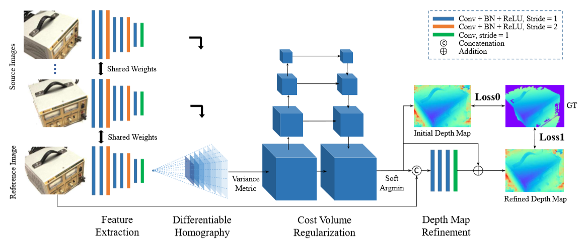

# 目录

- [目录](#目录)
- [MVSNet说明](#MVSNet说明)
- [模型架构](#模型架构)
- [数据集](#数据集)
- [环境要求](#环境要求)
- [快速入门](#快速入门)
- [脚本说明](#脚本说明)
  - [脚本和示例代码](#脚本和示例代码)
  - [脚本参数](#脚本参数)
  - [训练过程](#训练过程)
    - [训练](#训练)
    - [分布式训练](#分布式训练)
    - [迁移学习](#迁移学习)
  - [评估过程](#评估过程)
    - [验证](#验证)
    - [Test-dev](#test-dev)
  - [转换过程](#转换过程)
    - [转换](#转换)
  - [推理过程](#推理过程)
    - [用法](#用法)
    - [结果](#结果)
- [ModelZoo主页](#modelzoo主页)

# [MVSNet说明](#目录)

MVSNet(Multi-view Stereo Network) 是一种经典的端到端深度学习多视密集匹配模型，
用于对具有多视角影像的场景的密集匹配，不借助于核线影像和视差值，而直接从原始多视影像出发，
以一张中心影像和几张辅助影像，以及与影像对应的相机位姿参数作为输入，得到中心影像对应的深度图。 
MVSNet 将多视成像几何显式地编码进深度学习网络中，从而在几何约束条件的支持下，端到端的实现多
视影像间的密集匹配任务，是现有通用的多视密集匹配方法的基础和核心架构。

[论文](https://openaccess.thecvf.com/content_ECCV_2018/html/Yao_Yao_MVSNet_Depth_Inference_ECCV_2018_paper.html)：
Yao Y, Luo Z, Li S, et al. Mvsnet: Depth inference for unstructured multi-view stereo[C]//Proceedings of the European Conference on Computer Vision (ECCV). 2018: 767-783.

# [模型架构](#目录)



# [数据集](#目录)

使用的数据集：[WHU-MVS](http://gpcv.whu.edu.cn/data/WHU_MVS_Stereo_dataset.html)  
支持的数据集：[WHU-MVS]或与WHU-MVS格式相同的数据集  


- 目录结构如下：

    ```text
        ├── dataset
            ├── WHU_MVS_dataset
                ├── README.txt
                ├── test
                │   ├─ index.txt
                │   ├─ pair.txt
                │   ├─ Cams
                │   │   ├─ 009_53
                │   │   │  ├─ 0
                │   │   │  │  ├─ 000000.txt
                │   │   │  │  └─ ...
                │   │   │  └─ ...
                │   │   └─ ...
                │   ├─ Depths
                │   │   ├─ 009_53
                │   │   │  ├─ 0
                │   │   │  │  ├─ 000000.png
                │   │   │  │  └─ ...
                │   │   │  └─ ...
                │   │   └─ ...
                │   ├─ Images
                │   │   ├─ 009_53
                │   │   │  ├─ 0
                │   │   │  │  ├─ 000000.png
                │   │   │  │  └─ ...
                │   │   │  └─ ...
                │   │   └─ ...
                ├── train
                    ├─ index.txt
                    ├─ pair.txt
                    ├─ Cams
                    │   ├─ 009_53
                    │   │  ├─ 0
                    │   │  │  ├─ 000000.txt
                    │   │  │  └─ ...
                    │   │  └─ ...
                    │   └─ ...
                    ├─ Depths
                    │   ├─ 009_53
                    │   │  ├─ 0
                    │   │  │  ├─ 000000.png
                    │   │  │  └─ ...
                    │   │  └─ ...
                    │   └─ ...
                    ├─ Images
                        ├─ 009_53
                        │  ├─ 0
                        │  │  ├─ 000000.png
                        │  │  └─ ...
                        │  └─ ...
                        └─ ...
    ```

建议用户使用WHU-MVS数据集来体验模型，
其他数据集需要使用与WHU-MVS相同的格式。

# [环境要求](#目录)

- 硬件 Ascend
    - 使用Ascend处理器准备硬件环境。
- 框架
    - [LuoJiaNet](http://58.48.42.237/luojiaNet/)
- 更多关于LuojiaNet的信息，请查看以下资源：
    - [LuoJiaNet教程](https://www.luojianet.cn/tutorials/zh-CN/master/index.html)
    - [LuoJiaNet Python API](https://www.luojianet.cn/docs/zh-CN/master/index.html)

# [快速入门](#目录)

- 通过官方网站安装LuoJiaNet后，您可以按照如下步骤进行训练和评估：

- [ModelArts](https://support.huaweicloud.com/modelarts/)上训练

  ```text
  # 在Ascend上训练8卡
  # （1）执行a或b。
  #       a. 在base_config.yaml文件中设置“enable_modelarts=True”。
  #          在base_config.yaml文件中设置“data_root='s3://dir_to_your_data'”。
  #          在base_config.yaml文件中设置"logdir='s3://dir_to_save_your_checkpoints/'"。
  #          在base_config.yaml文件中设置其他参数。
  #       b. 在网站UI界面添加“enable_modelarts=True”。
  #          在网站UI界面添加“data_root=s3://dir_to_your_data”。
  #          在网站UI界面上添加“logdir=s3://dir_to_save_your_checkpoints/”。
  #          在网站UI界面添加其他参数。
  # （3）上传或复制预训练的模型到S3桶。
  # （4）上传zip数据集到S3桶。 (您也可以上传源数据集，但可能很慢。)
  # （5）在网站UI界面上设置代码目录为“/path/MVSNet”。
  # （6）在网站UI界面上设置启动文件为“train.py”。
  # （7）在网站UI界面上设置“数据集路径”、“输出文件路径”和“作业日志路径”。
  # （8）创建作业。
  #
  # 在Ascend上评估8卡
  # （1）执行a或b。
  #       a. 在base_config.yaml文件中设置“enable_modelarts=True”。
  #          在base_config.yaml文件中设置“data_root='s3://dir_to_your_data'”。
  #          在base_config.yaml文件中设置"loadckpt='s3://dir_to_your_trained_ckpt/'"。
  #          在base_config.yaml文件中设置其他参数。
  #       b. 在网站UI界面添加“enable_modelarts=True”。
  #          在网站UI界面添加“data_root=s3://dir_to_your_data”。
  #          在网站UI界面上添加“loadckpt=s3://dir_to_save_your_checkpoints/”。
  #          在网站UI界面添加其他参数。
  # （3）上传或复制训练好的模型到S3桶。
  # （4）上传zip数据集到S3桶。 (您也可以上传源数据集，但可能很慢。)
  # （5）在网站UI界面上设置代码目录为“/path/MVSNet”。
  # （6）在网站UI界面上设置启动文件为“eval.py”。
  # （7）在网站UI界面上设置“数据集路径”、“输出文件路径”和“作业日志路径”。
  # （8）创建作业。
  #
  # 在Ascend上测试8卡
  # （1）执行a或b。
  #       a. 在base_config.yaml文件中设置“enable_modelarts=True”。
  #          在base_config.yaml文件中设置“data_root='s3://dir_to_your_data'”。
  #          在base_config.yaml文件中设置"loadckpt='s3://dir_to_your_trained_ckpt/'"。
  #          在base_config.yaml文件中设置“output='s3://dir_to_your_output'”。
  #          在base_config.yaml文件中设置其他参数。
  #       b. 在网站UI界面添加“enable_modelarts=True”。
  #          在网站UI界面添加“data_root=s3://dir_to_your_data”。
  #          在网站UI界面上添加“loadckpt=s3://dir_to_save_your_checkpoints/”。
  #          在网站UI界面添加“output=s3://dir_to_your_output”。
  #          在网站UI界面添加其他参数。
  # （3）上传或复制训练好的模型到S3桶。
  # （4）上传zip数据集到S3桶。 (您也可以上传源数据集，但可能很慢。)
  # （5）在网站UI界面上设置代码目录为“/path/MVSNet”。
  # （6）在网站UI界面上设置启动文件为“predict.py”。
  # （7）在网站UI界面上设置“数据集路径”、“输出文件路径”和“作业日志路径”。
  # （8）创建作业。
  ```

# [脚本说明](#目录)

## [脚本和示例代码](#目录)

```text
└─MVSNet
  ├─README.md
  ├─README_CN.md
  ├─figs
    ├─network.png
    ├─result.png 
  ├─scripts
    ├─eval.sh                         # 在Ascend中启动单机验证
    ├─predict.sh                      # 在Ascend中启动单机预测
    ├─train.sh                        # 在Ascend中启动单机训练
  ├─src
    ├─dataset.py                      # 数据读取文件
    ├─homography_warping.py           # 特征提取模块
    ├─loss.py                         # loss函数
    ├─module.py                       # 网络中间层
    ├─mvsnet.py                       # mvsnet网络模型
    ├─preprocess.py                   # 数据预处理模块
  ├─eval.py                           # 评估测试结果
  ├─predict.py                        # 推理端代码
  └─train.py                          # 训练网络
```

## [脚本参数](#目录)

train.py中主要参数如下：

```text
可选参数：
  --data_root           训练数据集目录
  --logdir              ckpt文件输出位置
  --normalize           对中心影像的处理方式
  --view_num            每次输入影像数
  --ndepths             深度值个数
  --max_w               图像最大宽度
  --max_h               图像最大高度
  --resize_scale        深度和图像的重采样范围
  --sample_scale        下采样范围
  --interval_scale      间隔范围
  --batch_size          每次训练的batch个数
  --adaptive_scaling    使图像尺寸拟合网络
  --epochs              训练的epoch个数
  --lr                  学习率的大小
  --decay_rate          学习率降低的幅度
  --decay_step          学习率在每多少个step降低
  --seed                随机数生成的种子
```

## [训练过程](#目录)

### 训练

在Ascend设备上，使用命令行语句执行单机训练示例（8卡）

```bash
sh train.sh
```
或
```
python train.py --data_root='/mnt/gj/stereo' --view_num=3 --ndepths=200 --max_w=768 --max_h=384 --epochs=50 --lr=0.001
```

上述python命令将在后台运行，您可以通过控制台查看结果。

训练结束后，您可在指定的输出文件夹下找到checkpoint文件。 得到如下损失值：

```text
INFO:epoch[1], iter[1], loss:5.710720062255859
INFO:epoch[1], iter[100], loss:0.36795997619628906
INFO:epoch[1], iter[200], loss:0.10597513616085052
INFO:epoch[1], iter[300], loss:0.06676928699016571
INFO:epoch[1], iter[400], loss:0.03752899169921875
INFO:epoch[1], iter[500], loss:0.010647434741258621
...
```

## [评估过程](#目录)

### 评估

在LuoJiaNet环境下执行以下命令进行评估

```bash
sh eval.sh
```
或
```
python eval.py --data_root='/mnt/gj/stereo' --loadckpt='./checkpoint_mvsnet/checkpoint_mvsnet_whu-30_3600.ckpt' --view_num=3 --ndepths=200
```

上述python命令将在后台运行。 您可以通过控制台查看结果。 

```text
[237|23120] mae(m): 0.23365437984466553 less_0.1(%):0.5838620310809849 less_0.3(%):0.8617089455319813 less_0.6(%):0.933216234270465 costs(s):4.020957946777344
[238|23120] mae(m): 0.27482447028160095 less_0.1(%):0.5554937658312621 less_0.3(%):0.8282509401268875 less_0.6(%):0.9103310535185669 costs(s):4.028299808502197
[239|23120] mae(m): 0.19670110940933228 less_0.1(%):0.5958889013221027 less_0.3(%):0.87319478211923 less_0.6(%):0.9412428918751208 costs(s):4.023674488067627
[240|23120] mae(m): 0.21704454720020294 less_0.1(%):0.5766613202396736 less_0.3(%):0.8653310772089616 less_0.6(%):0.9425298659550154 costs(s):4.017646551132202
[241|23120] mae(m): 0.18784381449222565 less_0.1(%):0.6529787356692109 less_0.3(%):0.8859097952913969 less_0.6(%):0.9484990183345936 costs(s):4.014329195022583
[242|23120] mae(m): 0.0660104751586914 less_0.1(%):0.8659562706242645 less_0.3(%):0.975391627862809 less_0.6(%):0.9924845434597553 costs(s):4.020938158035278
[243|23120] mae(m): 0.07678035646677017 less_0.1(%):0.7962809118683264 less_0.3(%):0.9797159142927866 less_0.6(%):0.9941439959852294 costs(s):4.020266771316528
[244|23120] mae(m): 0.10023777186870575 less_0.1(%):0.7594274844104453 less_0.3(%):0.9583871634978925 less_0.6(%):0.9808449386081808 costs(s):4.022864818572998
[245|23120] mae(m): 0.1368318796157837 less_0.1(%):0.6864005045641353 less_0.3(%):0.9390928696407015 less_0.6(%):0.9690683196115398 costs(s):4.022674322128296
[246|23120] mae(m): 0.27534329891204834 less_0.1(%):0.43458813874863084 less_0.3(%):0.8203653528567989 less_0.6(%):0.9094044280467831 costs(s):4.016152858734131
[247|23120] mae(m): 0.4002946615219116 less_0.1(%):0.3775923338803966 less_0.3(%):0.780497646723724 less_0.6(%):0.8537238732079157 costs(s):4.008270978927612
[248|23120] mae(m): 0.3604094684123993 less_0.1(%):0.4388138150867258 less_0.3(%):0.7510062903745401 less_0.6(%):0.841791146001119 costs(s):4.011101961135864
[249|23120] mae(m): 0.3522142171859741 less_0.1(%):0.4051108758787287 less_0.3(%):0.7359030209266346 less_0.6(%):0.8401901310968162 costs(s):4.016809701919556
[250|23120] mae(m): 0.19819286465644836 less_0.1(%):0.528171331078858 less_0.3(%):0.8644567381563728 less_0.6(%):0.9474257261185601 costs(s):4.015037536621094
[251|23120] mae(m): 0.18713697791099548 less_0.1(%):0.5376998928479391 less_0.3(%):0.8651240386832504 less_0.6(%):0.9492655336579543 costs(s):4.009562253952026
[252|23120] mae(m): 0.2237146645784378 less_0.1(%):0.4724661761215286 less_0.3(%):0.8232511613712659 less_0.6(%):0.9257298836933302 costs(s):3.998124361038208
...
```

## [推理过程](#目录)

### 用法

```shell
python predict.py --data_root='/mnt/gj/stereo' --loadckpt='./checkpoint_mvsnet/checkpoint_mvsnet_whu-30_3600.ckpt' --view_num=3 --ndepths=200 --output="result"
```

### 结果

推理结果保存在当前路径中，您可以在log文件中找到类似如下结果。

```text
epoch: 2 step: 17790, loss is 0.02419212833046913
epoch: 2 step: 17906, loss is 0.011356251314282417
epoch: 2 step: 17972, loss is 0.02342096157371998
epoch: 2 step: 17960, loss is 0.004157776013016701
epoch: 2 step: 17980, loss is 0.05269428342580795
epoch: 2 step: 17923, loss is 0.04649455100297928
epoch: 2 step: 17923, loss is 0.006960269529372454
epoch: 2 step: 17939, loss is 0.028233932331204414
epoch: 2 step: 17791, loss is 0.02926710993051529
epoch: 2 step: 17907, loss is 0.021246621385216713
epoch: 2 step: 17973, loss is 0.02130107581615448
epoch: 2 step: 17961, loss is 0.029121998697519302
epoch: 2 step: 17981, loss is 0.07342060655355453
epoch: 2 step: 17924, loss is 0.09391187131404877
...
```

# [ModelZoo主页](#目录)

请浏览官网[主页](https://gitee.com/mindspore/models)。
