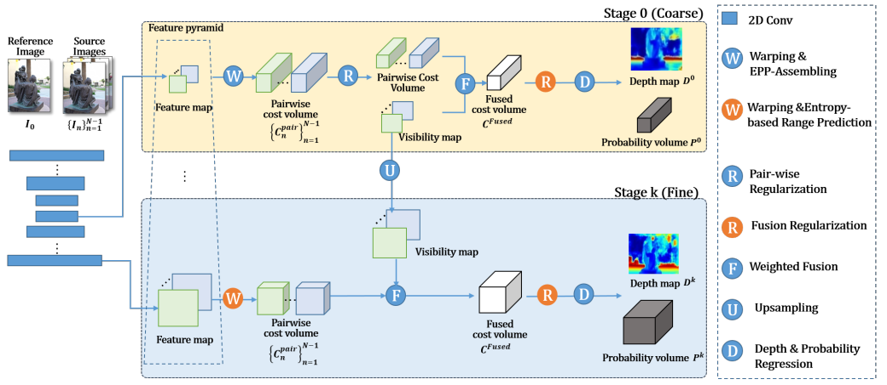

# Contents

- [Contents](#contents)
- [EPP-MVSNet Description](#EPP-MVSNet-description)
- [Model Architecture](#model-architecture)
- [Dataset](#dataset)
- [Environment Requirements](#environment-requirements)
- [Quick Start](#quick-start)
- [Script Description](#script-description)
    - [Script and Sample Code](#script-and-sample-code)
    - [Script Parameters](#script-parameters)
    - [Training Process](#training-process)
        - [Training](#training)
    - [Evaluation Process](#evaluation-process)
        - [Valid](#valid)
- [ModelZoo Homepage](#modelzoo-homepage)

# [EPP-MVSNet Description](#contents)

EPP-MVSNet was proposed in 2021 by Parallel Distributed Computing Lab & Huawei Riemann Lab. By aggregating features at high resolution to a
limited cost volume with an optimal depth range, thus, EPP-MVSNet leads to effective and efficient 3D construction. Moreover, EPP-MVSNet achieved
highest F-Score on the online TNT intermediate benchmark. This is a example of evaluation of EPP-MVSNet with BlendedMVS dataset in MindSpore. More
importantly, this is the first open source version for EPP-MVSNet.

[Paper](https://openaccess.thecvf.com/content/ICCV2021/html/Ma_EPP-MVSNet_Epipolar-Assembling_Based_Depth_Prediction_for_Multi-View_Stereo_ICCV_2021_paper.html)：
Ma X, Gong Y, Wang Q, et al. Epp-mvsnet: Epipolar-assembling based depth prediction for multi-view stereo[C]//Proceedings of the IEEE/CVF International Conference on Computer Vision. 2021: 5732-5740.


# [Model Architecture](#contents)



# [Dataset](#contents)

Dataset used：[BlendedMVS](https://github.com/YoYo000/BlendedMVS)  
Annotation support：[BlendedMVS]or annotation as the same format as BlendedMVS 

- The directory structure is as follows：

    ```text
        ├── dataset
            ├── BlendedMVS
                ├── training_list.txt
                ├── 57f8d9bbe73f6760f10e916a
                │   ├─ blended_images
                │   │  ├─ 00000000.jpg
                │   │  ├─ 00000000_masked.jpg  
                │   │  └─ ...
                │   ├── cams
                │   │  ├─ 00000000_cam.txt
                │   │  └─ ...
                │   ├── rendered_depth_maps
                │      ├─ 00000000.pfm
                │      └─ ...
                └─ ...
    ```
we suggest user to use BlendedMVS dataset to experience our model,
other datasets need to use the same format as BlendedMVS.

# [Environment Requirements](#contents)

- Hardware（Ascend）
    - Prepare hardware environment with Ascend processor.
- Framework
    - [LuojiaNet](http://58.48.42.237/luojiaNet/)
- For more information, please check the resources below：
    - [LuojiaNet tutorials](https://www.luojianet.cn/tutorials/zh-CN/master/index.html)
    - [LuojiaNet Python API](https://www.luojianet.cn/docs/zh-CN/master/index.html)

# [Quick Start](#contents)

- After installing MindSpore via the official website, you can start training and evaluation as follows:

- Train on [ModelArts](https://support.huaweicloud.com/modelarts/)

  ```text
  # Train 1p with Ascend
  # (1) Perform a or b.
  #       a. Set "enable_modelarts=True" on base_config.yaml file.
  #          Set "root_dir='s3://dataset/BlendedMVS/'" on base_config.yaml file.
  #          Set "ckpt_dir='s3://checkpoints/'" on base_config.yaml file.
  #          Set other parameters on base_config.yaml file you need.
  #       b. Add "enable_modelarts=True" on the website UI interface.
  #          Add "root_dir=s3://dataset/BlendedMVS/" on the website UI interface.
  #          Add "ckpt_dir=s3://checkpoints/" on the website UI interface.
  #          Add other parameters on the website UI interface.
  # (3) Upload or copy your pretrained model to S3 bucket.
  # (4) Upload a zip dataset to S3 bucket. (you could also upload the origin dataset, but it can be so slow.)
  # (5) Set the code directory to "/path/EPPMVSNet" on the website UI interface.
  # (6) Set the startup file to "train.py" on the website UI interface.
  # (7) Set the "Dataset path" and "Output file path" and "Job log path" to your path on the website UI interface.
  # (8) Create your job.
  #
  # Eval 1p with Ascend
  # (1) Perform a or b.
  #       a. Set "enable_modelarts=True" on base_config.yaml file.
  #          Set "root_dir='s3://dataset/BlendedMVS/'" on base_config.yaml file.
  #          Set "ckpt_path='s3://checkpoints/'" on base_config.yaml file.
  #          Set other parameters on base_config.yaml file you need.
  #       b. Add "enable_modelarts=True" on the website UI interface.
  #          Add "root_dir=s3://dataset/BlendedMVS/" on the website UI interface.
  #          Add "ckpt_path=s3://checkpoints/" on the website UI interface.
  #          Add other parameters on the website UI interface.
  # (3) Upload or copy your pretrained model to S3 bucket.
  # (4) Upload a zip dataset to S3 bucket. (you could also upload the origin dataset, but it can be so slow.)
  # (5) Set the code directory to "/path/EPPMVSNet" on the website UI interface.
  # (6) Set the startup file to "validate.py" on the website UI interface.
  # (7) Set the "Dataset path" and "Output file path" and "Job log path" to your path on the website UI interface.
  # (8) Create your job.
  ```
# [Script Description](#contents)

## [Script and Sample Code](#contents)

```
└─eppmvsnet
  ├─README.md
  ├─README_CN.md
  ├─src
  | ├─blendedmvs.py                     # build blendedmvs data
  | ├─eppmvsnet.py                      # main architecture of EPP-MVSNet
  | ├─modules.py                        # math operations used in EPP-MVSNet
  | ├─networks.py                       # sub-networks of EPP-MVSNet
  | └─utils.py                          # other operations used for evaluation
  ├─validate.py                         # Evaluation process on blendedmvs
  ├─train.py                            # Train process on blendedmvs
```

## [Script Parameters](#contents)

Major parameters train.py as follows:


  ```
  Optional parameter：
    --gpu_id              ID of the device to be trained
    --root_dir            Data set storage path
    --split               Training or testing
    --scan                Specifies the scan to be evaluated
    --n_views             Number of views used in the test (including refs)
    --depth_interval      The unit of depth interval is mm
    --n_depths            The depth of each layer
    --interval_ratios     The depth interval ratio multiplied by depth_interval in each layer
    --img_wh              The image resolution (img_w, img_h) must be a multiple of 32
    --ckpt_path           Pre-trained ckpt path loading
    --save_visual         Save depth and proba visualization
    --conf                The minimum confidence of pixels is valid
    --levels              Number of FPN levels (fixed at 3!)
    --amp_level           amp level
    --epochs              Total number of training
    --ckpt_dir            ckpt output path
  ```

## [Training Process](#contents)

### Training

For Ascend device, standalone training example(1p) by console

```
python train.py --root_dir='./dataset/BlendedMVS' --ckpt_dir='./checkpoints'
```

The python command above will run in the background, you can view the results through the console.

After the training, you can find the checkpoint file under the specified output folder. The following loss values are obtained：

```text
INFO:epoch[1], iter[1], loss:20.10311508178711
INFO:epoch[1], iter[100], loss:6.747747421264648
INFO:epoch[1], iter[200], loss:2.997436046600342
INFO:epoch[1], iter[300], loss:1.9435290098190308
INFO:epoch[1], iter[400], loss:1.1061981916427612
INFO:epoch[1], iter[500], loss:0.5989788770675659
...
```

## [Evaluation Process](#contents)

### Valid

Execute the following commands in the LuoJiaNet environment for evaluation

```
python validate.py --root_dir='./dataset/BlendedMVS' --ckpt_path='./checkpoints'
```

The above python command will run in the background. You can view the results via the file metrics.txt.

```text
stage3_l1_loss:1.1738
stage3_less1_acc:0.8734
stage3_less3_acc:0.938
mean forward time(s/pic):0.1259
```


# [ModelZoo Homepage](#contents)

 Please check the official [homepage](https://gitee.com/mindspore/models).
