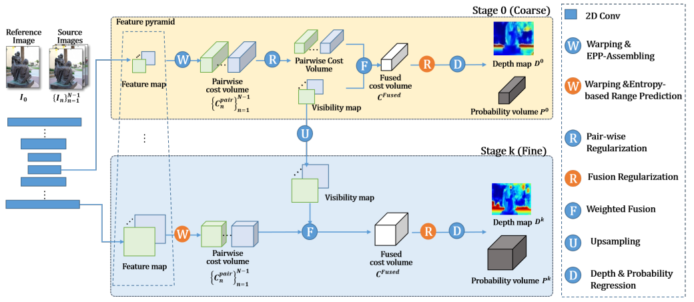

# 目录

- [目录](#目录)
- [EPP-MVSNet说明](#EPPMVSNet说明)
- [模型架构](#模型架构)
- [数据集](#数据集)
- [环境要求](#环境要求)
- [快速入门](#快速入门)
- [脚本说明](#脚本说明)
  - [脚本和示例代码](#脚本和示例代码)
  - [脚本参数](#脚本参数)
  - [训练过程](#训练过程)
    - [训练](#训练)
  - [评估过程](#评估过程)
    - [验证](#验证)
- [ModelZoo主页](#modelzoo主页)

# [EPP-MVSNet说明](#目录)

EPP-MVSNet是一种针对深度假设进行合理设置的高精高效稠密重建算法，继承了coarse-to-fine思想，在此基础上分别对于
coarse阶段和fine阶段的深度假设分别提出了对应的EAM(epipolar assembling module)和ER(entropy refining 
strategy)模块进行优化。同时，通过对3D正则网络进行精简，进一步提升了整个模型的计算效率。 EAM模块有效解决了coarse
阶段全局深度假设范围下深度间隔相对较大导致的采样稀疏问题，借助动态pooling的设计控制了计算量的同时提升了深度预测精度
。ER模块为coarse-to-fine方法在refine阶段的深度假设设置提供了新思路。

[论文](https://openaccess.thecvf.com/content/ICCV2021/html/Ma_EPP-MVSNet_Epipolar-Assembling_Based_Depth_Prediction_for_Multi-View_Stereo_ICCV_2021_paper.html)：
Ma X, Gong Y, Wang Q, et al. Epp-mvsnet: Epipolar-assembling based depth prediction for multi-view stereo[C]//Proceedings of the IEEE/CVF International Conference on Computer Vision. 2021: 5732-5740.
# [模型架构](#目录)



# [数据集](#目录)

使用的数据集：[BlendedMVS](https://github.com/YoYo000/BlendedMVS)  
支持的数据集：[BlendedMVS]或与BlendedMVS格式相同的数据集  


- 目录结构如下：

    ```text
        ├── dataset
            ├── BlendedMVS
                ├── training_list.txt
                ├── 57f8d9bbe73f6760f10e916a
                │   ├─ blended_images
                │   │  ├─ 00000000.jpg
                │   │  ├─ 00000000_masked.jpg  
                │   │  └─ ...
                │   ├── cams
                │   │  ├─ 00000000_cam.txt
                │   │  └─ ...
                │   ├── rendered_depth_maps
                │      ├─ 00000000.pfm
                │      └─ ...
                └─ ...
    ```

建议用户使用BlendedMVS数据集来体验模型，
其他数据集需要使用与BlendedMVS相同的格式。

# [环境要求](#目录)

- 硬件 Ascend
    - 使用Ascend处理器准备硬件环境。
- 框架
    - [LuoJiaNet](https://www.mindspore.cn/install)
- 更多关于LuojiaNet的信息，请查看以下资源：
    - [LuoJiaNet教程](https://www.mindspore.cn/tutorials/zh-CN/master/index.html)
    - [LuoJiaNet Python API](https://www.mindspore.cn/docs/zh-CN/master/index.html)

# [快速入门](#目录)

- 通过官方网站安装LuoJiaNet后，您可以按照如下步骤进行训练和评估：


- [ModelArts](https://support.huaweicloud.com/modelarts/)上训练

  ```text
  # 在Ascend上训练1卡
  # （1）执行a或b。
  #       a. 在base_config.yaml文件中设置“enable_modelarts=True”。
  #          在base_config.yaml文件中设置“root_dir='s3://dataset/BlendedMVS/'”。
  #          在base_config.yaml文件中设置"ckpt_dir='s3://checkpoints/'"。
  #          在base_config.yaml文件中设置其他参数。
  #       b. 在网站UI界面添加“enable_modelarts=True”。
  #          在网站UI界面添加“root_dir=s3://dataset/BlendedMVS/”。
  #          在网站UI界面上添加“ckpt_dir=s3://checkpoints/”。
  #          在网站UI界面添加其他参数。
  # （3）上传或复制预训练的模型到S3桶。
  # （4）上传zip数据集到S3桶。 (您也可以上传源数据集，但可能很慢。)
  # （5）在网站UI界面上设置代码目录为“/path/EPPMVSNet”。
  # （6）在网站UI界面上设置启动文件为“train.py”。
  # （7）在网站UI界面上设置“数据集路径”、“输出文件路径”和“作业日志路径”。
  # （8）创建作业。
  #
  # 在Ascend上评估1卡
  # （1）执行a或b。
  #       a. 在base_config.yaml文件中设置“enable_modelarts=True”。
  #          在base_config.yaml文件中设置“root_dir='s3://dataset/BlendedMVS/'”。
  #          在base_config.yaml文件中设置"ckpt_path='s3://checkpoints/'"。
  #          在base_config.yaml文件中设置其他参数。
  #       b. 在网站UI界面添加“enable_modelarts=True”。
  #          在base_config.yaml文件中设置“root_dir=s3://dataset/BlendedMVS/”。
  #          在base_config.yaml文件中设置"ckpt_path=s3://checkpoints/"。
  #          在网站UI界面添加其他参数。
  # （3）上传或复制训练好的模型到S3桶。
  # （4）上传zip数据集到S3桶。 (您也可以上传源数据集，但可能很慢。)
  # （5）在网站UI界面上设置代码目录为“/path/EPPMVSNet”。
  # （6）在网站UI界面上设置启动文件为“validate.py”。
  # （7）在网站UI界面上设置“数据集路径”、“输出文件路径”和“作业日志路径”。
  # （8）创建作业。
  ```

# [脚本说明](#目录)

## [脚本和示例代码](#目录)

```text
└─eppmvsnet
  ├─README.md
  ├─README_CN.md
  ├─src
  | ├─blendedmvs.py                     # 构建blendedmvs数据
  | ├─eppmvsnet.py                      # EPP-MVSNet的主要架构
  | ├─modules.py                        # EPP-MVSNet中使用的数学运算
  | ├─networks.py                       # EPP-MVSNet的子网络
  | └─utils.py                          # 用于求值的其他操作
  ├─validate.py                         # blendedmvs的评估过程
  ├─train.py                            # blendedmvs的训练过程
```

## [脚本参数](#目录)

train.py中主要参数如下：

```text
可选参数：
  --gpu_id              进行训练的设备ID
  --root_dir            数据集存储路径
  --split               进行训练还是测试
  --scan                指定要计算的scan
  --n_views             在测试中使用的视图数量(包括ref)
  --depth_interval      深度间隔单位为mm
  --n_depths            每一层的深度数
  --interval_ratios     在每一层中与depth_interval相乘的深度间隔比率
  --img_wh              图像的分辨率(img_w, img_h)必须是32的倍数
  --ckpt_path           预训练的ckpt路径加载
  --save_visual         保存深度和proba可视化与否
  --conf                像素的最小置信度是有效的
  --levels              FPN级别数(固定为3!)
  --amp_level           amp等级
  --epochs              总训练次数
  --ckpt_dir            ckpt输出路径
```

## [训练过程](#目录)

### 训练

在Ascend设备上，使用命令行语句执行单机训练示例（1卡）

```
python train.py --root_dir='./dataset/BlendedMVS' --ckpt_dir='./checkpoints'
```

上述python命令将在后台运行，您可以通过控制台查看结果。

训练结束后，您可在指定的输出文件夹下找到checkpoint文件。 得到如下损失值：

```text
INFO:epoch[1], iter[1], loss:20.10311508178711
INFO:epoch[1], iter[100], loss:6.747747421264648
INFO:epoch[1], iter[200], loss:2.997436046600342
INFO:epoch[1], iter[300], loss:1.9435290098190308
INFO:epoch[1], iter[400], loss:1.1061981916427612
INFO:epoch[1], iter[500], loss:0.5989788770675659
...
```

## [评估过程](#目录)

### 评估

在LuoJiaNet环境下执行以下命令进行评估

```
python validate.py --root_dir='./dataset/BlendedMVS' --ckpt_path='./checkpoints'
```

上述python命令将在后台运行。 您可以通过metrics.txt文件查看结果。 

```text
stage3_l1_loss:1.1738
stage3_less1_acc:0.8734
stage3_less3_acc:0.938
mean forward time(s/pic):0.1259
```

# [ModelZoo主页](#目录)

请浏览官网[主页](https://gitee.com/mindspore/models)。
