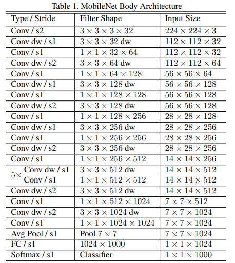
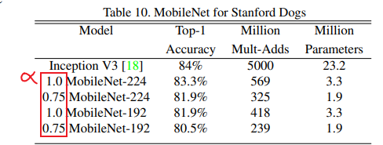

# Readme

## Contents

- [Readme](#readme)
  - [Contents](#contents)
  - [Model Description](#model-description)
  - [Model Architecture](#model-architecture)
  - [Dataset](#dataset)
  - [Environment Requirements](#environment-requirements)
  - [Quick Start(Optional)](#quick-startoptional)
  - [Script Description](#script-description)
    - [Script and Sample Code](#script-and-sample-code)
    - [Training Process](#training-process)
      - [Script Parameters](#script-parameters)
      - [Training](#training)
    - [Evaluation Process](#evaluation-process)
    - [Inference Process](#inference-process)
  - [Description of Random Situation](#description-of-random-situation)
  - [ModelZoo Homepage](#modelzoo-homepage)

## [Model Description](#contents)

MobileNet network was proposed by Google team in 2017, focusing on lightweight CNN network in mobile terminal or embedded devices. Compared with the traditional convolution neural network, it can greatly reduce the model parameters and calculation amount on the premise of slightly reducing the accuracy. The basic unit of MobileNet is deeply separable convolution. Deep separable convolution is actually a decomposable convolution operation, which can be decomposed into two smaller operations: depthwise convolution and pointwise convolution.

[Paper Link](https://arxiv.org/abs/1704.04861):
Howard, Andrew G. et al. “MobileNets: Efficient Convolutional Neural Networks for Mobile Vision Applications.” ArXiv abs/1704.04861 (2017): n. pag.

## [Model Architecture](#contents)




## [Dataset](#contents)

Dataset used：[WHU-RS19](http://www.captain-whu.com/repository.html)  
Annotation support：[WHU-RS19]or annotation as the same format as WHU-RS19

- The directory structure is as follows：
    ```text
        ├── dataset
            ├── WHU-RS19
               ├── class1
               │    ├── 000000000001.jpg
               │    ├── 000000000002.jpg
               │    ├── ...
               ├── class2
               │    ├── 000000000001.jpg
               │    ├── 000000000002.jpg
               │    ├── ...
               ├── class3
               │    ├── 000000000001.jpg
               │    ├── 000000000002.jpg
               │    ├── ...
               ├── classN
               ├── ...
    ```

## [Environment Requirements](#contents)

This code is Huawei Modelarts Ascend platform **8P** version

- Hardware
    - Prepare hardware environment with Ascend platform.
- Framework
    - [LuojiaNet](http://58.48.42.237/luojiaNet/)
- For more information, please check the resources below：
    - [LuojiaNet tutorials](http://58.48.42.237/luojiaNet/tutorial/quickstart/)
    - [LuojiaNet Python API](http://58.48.42.237/luojiaNet/luojiaNetapi/)

## [Quick Start(Optional)](#contents)

- After installing LuojiaNet via the official website, you can start training and evaluation as follows:

- Train on [ModelArts](https://support.huaweicloud.com/modelarts/)

 ```text
  # Train 8p with Ascend
  # (1) Upload or copy your pretrained model to S3 bucket.
  # (2) Upload a zip dataset to S3 bucket. (you could also upload the origin dataset, but it can be so slow.)
  # (3) Set the code directory to "/path/MobileNet" on the website UI interface.
  # (4) Set the startup file to "train.py" on the website UI interface.
  # (5) Set the "Dataset path" and "Output file path" and "Job log path" to your path on the website UI interface.
  # (6) Create your job.
  #
  # Eval 8p with Ascend
  # (1) Upload or copy your pretrained model to S3 bucket.
  # (2) Upload a zip dataset to S3 bucket. (you could also upload the origin dataset, but it can be so slow.)
  # (3) Set the code directory to "/path/MobileNet" on the website UI interface.
  # (4) Set the startup file to "eval.py" on the website UI interface.
  # (5) Set the "Dataset path" and "Output file path" and "Job log path" to your path on the website UI interface.
  # (6) Create your job.
  ```

## [Script Description](#contents)

### [Script and Sample Code](#contents)

```text
└─MobileNet
  ├─README.md
  ├─README_CN.md
  ├─mobilenet.py                    # MobileNet network model
  ├─config.py                       # Model configuration
  ├─utils.py                        # Data reading function, loss function, etc
  ├─test.py                         # Eval net
  ├─eval.py                         # Inference net
  └─train.py                        # Train net
```


### [Training Process](#contents)

#### [Script Parameters](#contents)

Major parameters ``config.py`` as follows:

```    
    "device_target":"Ascend",                          #GPU、CPU、Ascend
    "dataset_path": "WHU-RS19/",                       # dataset path
    "save_checkpoint_path": "./checkpoint",            # save checkpoint path
    "resume":False,                                    # Whether to load pretrained model to train
    "class_num": 19,                                   # Types included in the data set
    "batch_size": 4,
    "loss_scale": 1024,
    "momentum": 0.9,
    "weight_decay": 1e-5,
    "epoch_size": 350,                                  # training epoch
    "save_checkpoint": True,                            # Whether to save checkpoint
    "save_checkpoint_epochs": 1,                        # Save the model for every xx epoches
    "keep_checkpoint_max": 100,                         # The maximum number of models to save
    "opt": 'sgd',                                       #optimizer：rmsprop或sgd
    "opt_eps": 0.001, 
    "warmup_epochs": 50,                                # The number of epochs that the learning rate decays
    "lr_decay_mode": "warmup",                          #learning rate decays modes：steps、poly、cosine以及warmup
    "use_label_smooth": True, 
    "label_smooth_factor": 0.1,
    "lr_init": 0.0001,                                  # Init learning rate
    "lr_max": 0.001,                                    # Maximum learning rate
    "lr_end": 0.00001                                   # Minimum learning rate
```


#### [Training](#contents)

Run ``python train.py`` on the terminal for training


### [Evaluation Process](#contents)

Run ``python eval.py --checkpoint_path **** --dataset_path ****`` on the terminal to evaluate, with the following parameters:

```
    --checkpoint_path, type=str, default=None, help='Saved checkpoint file path'
    --dataset_path, type=str, default=None, help='Eval dataset path'
    --device_target, type=str, default=config.device_target, help='Device target'
    --device_id, type=int, default=config.device_id, help='Device id'
```

### [Inference Process](#contents)

Run ``python test.py --input_file **** --output_folder **** --checkpoint_path **** --classes_file ****``  on the terminal to inference, with the following parameters:

```
    --input_file, type=str, default=None, help='Input file path'
   --output_folder, type=str, default=None, help='Output file path'
   --checkpoint_path, type=str, default=None, help='Saved checkpoint file path'
   --classes_file, type=str, default=None, help='Classes saved txt path '
   --device_target, type=str, default="Ascend", help='Device target'
```

## [Description of Random Situation](#contents)

There are random seeds in ``eval.py`` and ``test.py`` files.

## [ModelZoo Homepage](#contents)

Please check the [Model Zoo](https://github.com/WHULuoJiaTeam/Model_Zoo).
