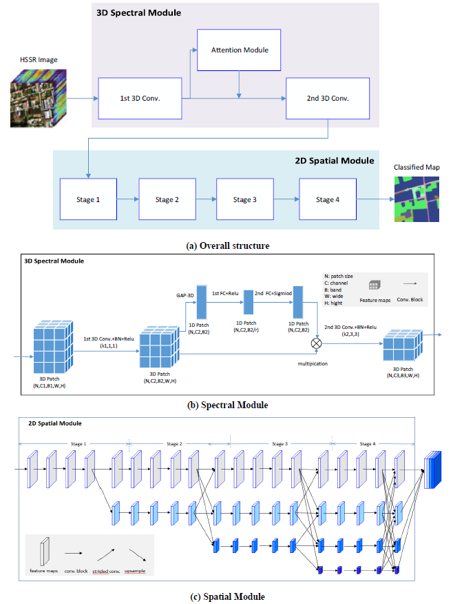

# Readme
## 目录

- [Readme](#readme)
  - [目录](#目录)
  - [模型说明](#模型说明)
  - [模型架构](#模型架构)
  - [数据集](#数据集)
  - [环境要求](#环境要求)
  - [脚本说明](#脚本说明)
    - [脚本和示例代码](#脚本和示例代码)
    - [训练过程](#训练过程)
      - [脚本参数](#脚本参数)
      - [训练](#训练)
    - [评估过程](#评估过程)
    - [推理过程](#推理过程)
- [随机情况说明](#随机情况说明)
- [ModelZoo主页](#modelzoo主页)

## [模型说明](#目录)

高分辨网络（High-Resolution Net, HRNet）在运算全部过程中都可以保持高分辨表征。它始于一组高分辨率卷积，然后逐步添加低分辨率的卷积分支，并将它们以并行的方式连接起来。最终的网络由若干阶段组成，其中第n段包含n个卷积分支并且具备n个不同的分辨率。在整个过程中并行的运算组合间通过多分辨率融合不断地交换着信息。

论文链接: https://doi.org/10.48550/arXiv.1908.07919

## [模型架构](#目录)



## [数据集](#目录)

WHU_OHS数据集由来自 40 个中国地点的 7795 个 Orbita 高光谱卫星 (OHS) 图像块（大小为 512 × 512）的约 9000 万个手动标记样本组成。该数据集的范围从可见光到近红外范围，平均光谱分辨率为 15 nm。WHU-OHS 数据集广泛的地理分布、大的空间覆盖范围和广泛使用的分类系统使它成为一个具有挑战性的基准。

下载链接：http://irsip.whu.edu.cn/resources/WHU_OHS_show.php

将数据集的影像（训练集和测试集的所有影像）放入"image"文件夹，训练集标签放入"train"文件夹，测试集标签放入"test"文件夹，标签的名字和对应影像的名字相同，例如，将数据组织成以下格式：
```    
    └── data
         ├── image
         │    ├── 1.tif
         │    ├── 2.tif
         │    ├── 3.tif
         ├── train
         │    ├── 1.tif
         │    ├── 2.tif
         ├── test
         │    ├── 3.tif
```

## [环境要求](#目录)
- 硬件 Ascend
    - 使用 Ascend处理器 或 GPU 准备硬件环境。
- 框架
    - [LuojiaNet](http://58.48.42.237/luojiaNet/)
- 更多关于LuojiaNet的信息，请查看以下资源：
    - [LuojiaNet tutorials](http://58.48.42.237/luojiaNet/tutorial/quickstart/)
    - [LuojiaNet Python API](http://58.48.42.237/luojiaNet/luojiaNetapi/)

## [脚本说明](#目录)

### [脚本和示例代码](#目录)

```text
└─HRNET
  ├── README.md
  ├── README_CN.md
  ├── config.py                     # 模型设置
  ├── dataset.py                    # 数据读取
  ├── eval.py                       # 评估结果
  ├── model.py                      # HRNET网络模型
  ├── predict.py
  └── train.py
```


### [训练过程](#目录)

#### [脚本参数](#目录)

config.py中主要参数如下：

```
    device_target = 'Ascend', # 设备类型，CPU,Ascend或者GPU
    dataset_path = '/cache/dataset/', # 数据集根目录，如组织格式示例中的data文件夹所在位置
    normalize = False, # 是否对影像进行归一化，False或True，若为True，则逐波段进行标准差归一化
    nodata_value = 0, # 标签中的Nodata值（即不作为样本的像素值）
    in_channels = 32, # 输入通道数（即影像波段数）
    classnum = 24, # 类别数量
    batch_size = 2, # 训练时的batchsize
    num_epochs = 100, # 训练迭代次数
    weight = None, # 是否在损失函数中对各类别加权，默认为不加权（None），若需要加权，则给出一个各类别权重的list
    learning_rate = 1e-4, # 训练学习率
    save_model_path = '/cache/checkpoint/' # 训练模型文件保存路径
```

#### [训练](#目录)
在终端运行``python train.py``进行训练

### [评估过程](#目录)
在终端运行
```
python eval.py --dataset_path xxx --checkpoint_path xxx --device_target xxx
```
进行网络的测试。其中``--dataset_path``为测试集根目录，``--checkpoint_path``为训练好的模型路径，``--device_target``为设备类型，包括CPU、GPU、Ascend

### [推理过程](#目录)

在终端运行

```
python predict.py --input_file xxx --output_folder xxx --checkpoint_path xxx --device_target xxx
```
进行网络的预测。其中``--input_file``为输入的单张影像路径，``--output_folder``为输出的结果所在文件夹，输出结果文件名与输入影像相同，保存为tif格式，``--checkpoint_path``为训练好的模型路径，``--device_target``为设备类型，包括CPU、GPU、Ascend
# [随机情况说明](#目录)

在本项目中，我们并没有设置权重初始化的种子。

# [ModelZoo主页](#目录)

请浏览[Model Zoo](https://github.com/WHULuoJiaTeam/Model_Zoo)。
